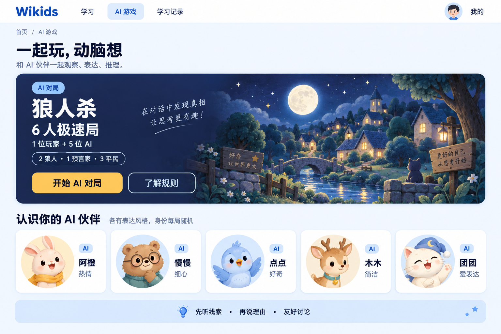
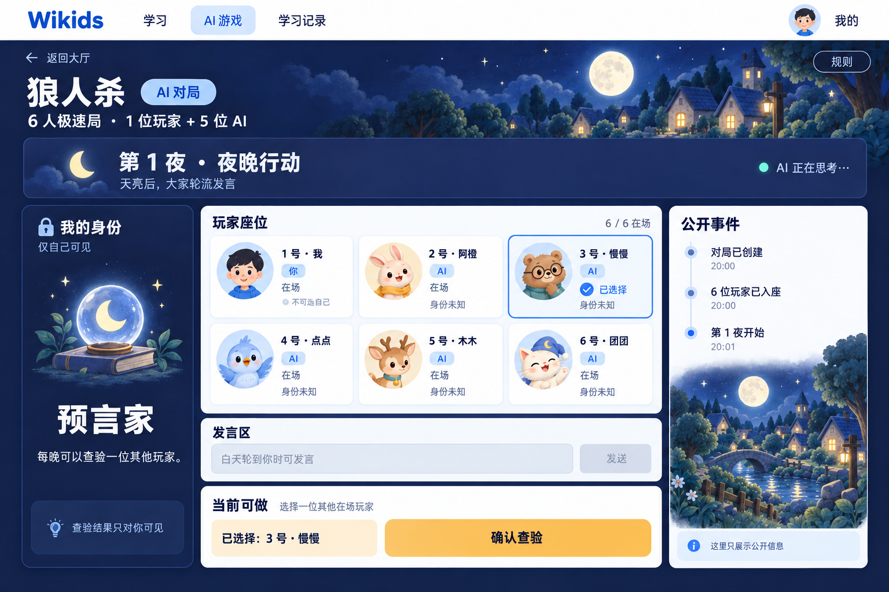
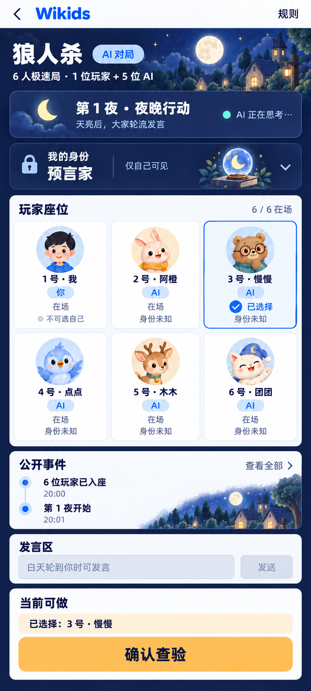

# Wikids AI 狼人杀视觉规范

- 规则版本：`quick6-v1`
- 设计版本：v1 / 2026-09-16
- 交付范围：桌面大厅、桌面对局、移动对局三张独立 PNG，以及本规范。
- 设计确认：等待账户所有者在 [设计狼人杀 UI 高保真效果图与视觉规范](orbit-task:34PMZw4n8aoZwZ9ejIjGy) 中选择 **Confirm done** 或 **Send back…**；图像生成、文件检查和 agent 评论不代表所有者已确认。

> **效果图仅作设计参考，不构成像素级实现约束。** 后续实现优先遵守本规范中的信息层级、规则与隐私边界、交互语义、可读性和触控要求。图中插画、字形、文案装饰、像素位置与色值可能有生成偏差；不能把整张 PNG 当作可交互页面，也不能从画面推导新的游戏规则。

## 1. 现有站点检查与设计依据

检查时工作区基线为 `96620f4`，未发现现成游戏页面或 `docs/design/werewolf/` 资产，也未发现适用的 `AGENTS.md`。

| 已检查文件 | 现有语言 | 本方案如何延续 |
| --- | --- | --- |
| `app/globals.css` | `bg-slate-50`、`text-slate-900`、系统无衬线字体、抗锯齿 | 大厅保留明亮浅灰底；对局增加局部夜色主题；正文保持清晰无衬线 |
| `app/layout.tsx` | 全局站点头、`max-w-5xl`、16/24/32px 响应式留白 | 保留导航与内容层级；游戏工作区可在后续实现时独立评估较宽容器 |
| `app/page.tsx` | 白色 `rounded-2xl` 主卡片、`rounded-xl` 列表、细边框、轻阴影 | 使用相同卡片结构，插画集中于大厅主卡与次要空白区域 |
| `components/site-header.tsx` | 白色导航、蓝色 Wikids 文字标识、简洁链接 | 保留文字标识和白色导航；图中中文导航及 AI 游戏入口是本次设计提案 |
| `tailwind.config.ts` | brand-50 #EEF6FF、100 #D9EAFF、500 #3B82F6、600 #2563EB、700 #1D4ED8 | 蓝色品牌标识与浅蓝选中导航直接延续；夜间配色作为模块扩展 |
| `components/study-stats-overview.tsx` | 圆角指标卡、标题与次级说明层级 | 阶段、人数与事件采用清晰标签、留白和细线分组 |
| `components/mdx/character-card.tsx` | 友好头像、蓝/琥珀色渐变卡、胶囊标签 | 采用中性人格头像、私密身份卡和暖琥珀主操作 |
| `components/mdx/chat-dialog.tsx` | 柔和色彩、圆角对话与细边框 | 发言内容维持易读、可辨认说话人的卡片语言 |

这些检查基于仓库源码，并非已实现游戏的浏览器截图。本任务没有修改生产页面、组件、全局样式、依赖或业务逻辑。

## 2. 规则、画面状态与信息边界

### 已确认的规则范围

依据 [Wikids AI 游戏模块：狼人杀 MVP](orbit-project:34Dz4yBCUGSSoOkER2Dlw) 的项目上下文与 [规则规格任务](orbit-task:34DzFbIQIamcDvynTUKTI)：

- 固定 **6 个座位 = 1 位登录用户 + 5 位独立 AI**。
- 全局身份配置固定为 **2 狼人、1 预言家、3 平民**；大厅可以展示配置总量。
- 首版没有女巫、猎人、警长，也没有多人实时匹配、邀请好友或额外观众席。
- 对局明确标注“AI 对局”；每位 AI 座位另有 AI 标签，防止误认真人。
- 阶段、在场名单、当前发言者、合法选项与结果由服务端授权视图提供。UI 不生成规则，不推测隐藏身份。

当前工作区尚无冻结后的完整规则文档。平票细则、最大轮数、超时和胜负边界交由已有规则规格/引擎任务确定，本方案不新增这些规则，也不展示未经确认的时长承诺或倒计时。

### 两张对局图共用同一场景

| 项目 | 统一取值 |
| --- | --- |
| 当前阶段 | 第 1 夜 · 夜晚行动 |
| 人数 | 6 / 6 在场；没有已离场者 |
| 人类玩家 | 1 号 · 我 |
| 自己的身份 | 预言家，仅自己可见 |
| 其他身份 | 未知，不展示其阵营或具体身份 |
| 本地选择 | 3 号 · 慢慢；仅选中，尚未确认查验 |
| 当前合法主操作 | 确认查验 |
| 发言区 | 夜间禁用，说明“白天轮到你时可发言” |
| AI 状态 | “AI 正在思考…”的整体提示，不关联具体夜间座位 |
| 公开记录 | 对局已创建 → 6 位玩家已入座 → 第 1 夜开始 |
| 查验结果 | 未产生、未展示 |

### 可见性设计

- **公开区域**：座位号、昵称、人格头像、AI 标记、在场/离场、公开阶段、授权公开发言与事件。
- **私密区域**：我的身份、我的查验选择与查验结果，统一加锁图标与“仅自己可见”。结果只出现在私密卡/抽屉，不能流入公开时间线。
- **夜间状态**：对未获授权者统一展示“夜晚行动”和整体 AI 进度。不能把某个 AI 的头像点亮、显示“狼人正在选择”等隐藏子阶段，或显示按角色区分的请求/完成时间。
- **白天状态**：服务端已公开的当前发言者可以高亮，显示“正在发言”或“正在组织发言”；仍不得展示原始推理过程、私密 Prompt、隐藏角色置信度。
- 狼人玩家依法获知的队友信息、预言家的已查验信息，仅可放在相应私密区，依据授权视图显示；本次概念图没有这些信息。
- AI 公开发言可能包含角色自述，那是玩家发言而非系统验证的身份标签。不得将自述自动绘制成真实身份徽标。
- 离场座位保留原位置、号码和中性头像，使用“离场”或“已淘汰”，不提前翻身份牌。结束后的角色揭示必须等待授权终局视图。
- 不用动物种类、配色、装饰道具或人格性格暗示身份；每局身份分配与人格外观独立。

## 3. 三张图的布局

### 3.1 桌面大厅

优先级：**游戏名称与 AI 属性 → 人数与身份配置 → 开始操作 → AI 人格介绍 → 友好讨论提示**。

1. 白色站点导航：Wikids / 学习 / AI 游戏 / 学习记录 / 我的。
2. 页头标题“一起玩，动脑想”，副标题说明观察、表达、推理。
3. 宽幅圆角主卡：左侧标题、6 人极速局、人数、规则和按钮；右侧月光村庄插画。主操作“开始 AI 对局”，次操作“了解规则”。
4. 五张 AI 人格介绍卡：强调“各有表达风格，身份每局随机”。这是五位 AI 介绍，不能误作只有五人的游戏棋盘。
5. 底部“先听线索 · 再说理由 · 友好讨论”提示。
6. 插画上的额外手写句子/木牌文字属于生成装饰，非必需产品文案，后续实现可省略。

桌面建议内容宽度 1200–1280px、外边距至少 32px；较窄视口保持留白并提前重排。此宽度为游戏页面设计建议，不要求改动现有全站 `max-w-5xl`。

### 3.2 桌面对局

优先级：**当前阶段 → 我能做什么/目标选择 → 六座位 → 私密身份 → 公开记录 → 发言可用性**。

- 顶部白色站点导航；夜色主内容标题行显示返回大厅、狼人杀、AI 对局、规则。
- 阶段条横贯工作区；左侧月亮图标与“第 1 夜 · 夜晚行动”，右侧整体 AI 状态。
- 主体三栏，建议比例约 **235 : 660 : 290**，栏间 20px。具体尺寸随容器调整。
- 左栏：我的身份卡，锁标记、“仅自己可见”、预言家、能力说明与私密提醒。
- 中栏：3 列 × 2 行的六座位；下方为发言区，再下方为当前合法动作。选中目标同时出现在座位与操作摘要中。
- 右栏：白纸色公开事件卡，深色文字；时间线从上到下为旧到新。插画仅填充多余空白，不挤压记录。
- 卡片底部不出现无授权的投票、夜间移出目标、弃权、跳过等按钮。

### 3.3 移动对局

优先级：**阶段/AI 状态 → 自己身份摘要 → 六座位 → 最近公开事件 → 发言状态 → 底部合法动作**。

- 顶部收紧为返回、Wikids 和规则；页面标题旁保留“AI 对局”。
- 身份卡变成紧凑横条，可展开私密详情；锁标记与“仅自己可见”始终可识别。
- 六座位仍采用 **3 列 × 2 行**，不做水平轮播，不藏起离场座位。
- 公开记录展示最近两条，保留“查看全部”；展开后仍保持旧到新的时间顺序。
- 夜间发言区保留禁用说明，避免用户以为缺少发言功能。
- 底部固定操作区显示“当前可做”、已选目标与“确认查验”。按钮在拇指触达区，面板不可覆盖正文。
- 插画缩减为小图标、头像和轻背景；把空间留给状态与操作。
- 移动 PNG 为高密度概念输出，不能直接把图片像素当作 CSS 像素。实现时以 390px 左右视口、44–48px 最小触控面积和真实文字测量校准。

## 4. 色板与形状

以下是实现建议色值；生成图片为近似演绎。

| Token / 用途 | 色值 | 使用原则 |
| --- | --- | --- |
| Brand / Wikids 标识与浅色界面焦点 | `#2563EB` | 延续现有 brand-600 |
| Brand hover | `#1D4ED8` | 浅色链接、按钮悬停 |
| Lobby background | `#F8FAFC` | 大厅浅灰底 |
| Paper / 主卡底色 | `#F7F9FF` | 事件和轻内容卡 |
| White / 导航 | `#FFFFFF` | 白色站点头 |
| Night / 深靛蓝 | `#171D3B` | 对局页面与大厅主卡 |
| Night surface / 抬高卡片 | `#242D52` | 阶段与私密身份容器；选定图中的棋盘、发言、动作内容使用纸色卡以强化阅读 |
| Moon / 月光蓝 | `#BDD9FF` | 选中描边、月亮、信息强调 |
| Amber / 暖琥珀 | `#F4BF69` | 唯一当前主操作、暖窗光 |
| Amber hover | `#F8CC86` | 主按钮悬停/按下反馈 |
| Teal / 青绿色 | `#69C8B5` | 整体 AI/连接状态的小面积点缀 |
| Night text / 夜间主文字 | `#EAF1FF` | 标题、正文 |
| Night muted / 夜间次级文字 | `#A7B8D8` | 提示、说明，不承载唯一状态 |
| Ink / 浅色底与琥珀按钮文字 | `#182344` | 高对比深色文字 |
| Paper muted / 浅色次级文字 | `#56678A` | 时间、说明 |
| Light border | `#DFE7F3` | 浅色卡片细描边 |
| Dark border | `#687CA4` | 需要可辨认的控件边界；弱装饰线可降低透明度 |

夜间背景占主导，月光蓝辅助分组，暖琥珀只强调当下主操作，青绿色控制在小面积。座位外观中的颜色表达人格，不表达身份阵营。

- 大卡片圆角：20–24px；标准卡：16px；紧凑座位：12–16px；按钮/输入框：12px；胶囊状态：999px。
- 基础间距：4、8、12、16、20、24、32px；桌面卡片内边距 20–24px，手机 12–16px。
- 边框：1px；选中目标：2px 月光蓝边框 + 勾选图标 + “已选择”。
- 阴影轻、扩散柔；避免厚重立体边框、霓虹发光和模糊玻璃影响文本。
- 插画保留少量纸感颗粒、圆树冠、暖窗与星点；正文、边框和图标区域不铺噪点。

## 5. 字体层级与可读性

沿用现有系统无衬线思路，中文建议回退：
`ui-sans-serif, system-ui, -apple-system, "PingFang SC", "Microsoft YaHei", "Noto Sans SC", "Segoe UI", sans-serif`。
无需为本提案增加在线字体依赖。

| 层级 | 桌面 CSS 建议 | 移动 CSS 建议 | 字重 / 行高 |
| --- | --- | --- | --- |
| 大厅展示标题 | 40–52px | 28–32px | 700 / 1.2 |
| 页面主标题 | 28–32px | 22–24px | 700 / 1.3 |
| 当前昼夜阶段 | 24–28px | 18–20px | 700 / 1.35 |
| 卡片标题 / 自己身份 | 18–22px | 16–18px | 600–700 / 1.4 |
| 正文 / 输入 | 16px | 16px | 400–500 / 1.5–1.65 |
| 座位姓名 | 15–16px | 13–14px | 600 / 1.4 |
| 辅助说明 / 标签 | 13–14px | 12–13px | 400–600 / 1.4 |
| 主按钮 | 17–18px | 16–17px | 600–700 / 1.4 |

- 正文不得为了挤进截图无限缩小；内容增多时滚动/重排。
- 中文正文不加宽字距；数字座位号固定宽度以便快速比对。
- 关键状态用文字、图标和轮廓共同表达，不只依靠色彩。
- 普通文字建议对比度至少 4.5:1，大字及关键非文本边界至少 3:1；最终实现应对真实渲染再测量。
- 键盘焦点：浅色背景用品牌蓝，深色背景用月光蓝，外环与控件之间保留 2px 间隔；焦点与选中状态分开。
- 月亮/太阳与“第 N 夜/天”成对出现，切换昼夜不依赖整页颜色突变。

## 6. AI 伙伴与关键组件状态

### 固定人格视觉表

| 座位 | 姓名 / 类型 | 外观 | 人格标签 | 身份处理 |
| --- | --- | --- | --- | --- |
| 1 | 我 / 人类 | 短黑发孩子、月光蓝上衣 | 你 | 身份只在私密卡显示 |
| 2 | 阿橙 / AI | 桃色兔子、琥珀围巾 | 热情 | 未知 |
| 3 | 慢慢 / AI | 棕色小熊、圆眼镜 | 细心 | 未知；本图是被选目标 |
| 4 | 点点 / AI | 粉蓝小鸟 | 好奇 | 未知 |
| 5 | 木木 / AI | 温和小鹿、青绿领饰 | 简洁 | 未知 |
| 6 | 团团 / AI | 奶油色猫、月蓝帽子 | 爱表达 | 未知 |

人格昵称与配件是本提案视觉设定，不承诺模型永远使用固定话术。禁止把兔/熊/鸟/鹿/猫映射为固定阵营，也不使用狼头像标识隐藏狼人。

### 组件状态表

| 组件 | 状态 | 视觉 / 文案 | 交互约束 |
| --- | --- | --- | --- |
| 开始对局 | 可开始 / 创建中 / 失败 | 琥珀“开始 AI 对局”；加载时“正在创建…”；失败时简短原因与重试 | 提交后锁定重复点击；成功进入同一对局 |
| 阶段条 | 夜间 / 白天 / 结算 | 月亮或太阳 + 第 N 夜/天 + 公开阶段名；结束用“本局结束” | 隐藏角色子阶段不出现在公共条 |
| 座位 | 默认在场 | 中性卡 + 号码、头像、姓名、AI/你、在场 | 是否可选完全取决于合法目标 |
| 座位 | 可选悬停 / 键盘焦点 | 轻背景变化 / 清晰外焦点环 | 不因 hover 产生提交 |
| 座位 | 选中 | 2px 月光蓝边 + 勾选 + 已选择 | 同步更新操作区目标摘要 |
| 座位 | 不合法目标 / 自己 | 不显示选择效果；需要时解释“不可选自己” | 不可提交；不可只通过变灰来限制 |
| 座位 | 白天当前发言者 | 小发言图标 + 正在发言 | 只根据公开发言次序展示 |
| 座位 | 离场 | 降低装饰饱和度，清晰保留“离场” | 保留位置，取消动作资格，不提前揭示身份 |
| 私密身份 | 默认 / 收起 / 展开 | 我的身份 + 锁 + 仅自己可见；手机紧凑摘要 | 展开查验等私密详情不改变公开区 |
| 私密结果 | 未提交 / 提交中 / 已获结果 | 未提交不显示结果；提交中“正在确认…”；成功显示授权内容 | 结果不得出现在其他座位公共标签或公开事件 |
| AI 进度 | 正在思考 | 三点/静态进度图标 + AI 正在思考… | 夜间只用整体状态；不展示原始思维过程 |
| AI 降级 | 简化策略继续 | “AI 将使用简化策略继续对局” + 中性提示 | 不暴露供应商错误、费用、请求栈或技术代码 |
| 发言区 | 自己回合 | 正常输入、明确发送按钮、可见字数限制 | 限制值来自产品/规则约束；不在图中虚构数值 |
| 发言区 | 夜间 / 他人回合 / 已离场 | 分别说明“白天轮到你时可发言” / “请等待其他玩家发言” / “你已离场，可继续观战” | 禁止发送；白天非自己回合是否能写本地草稿可后续决定 |
| 发言区 | 发送中 / 内容需调整 | 锁定发送、“正在发送…”；失败显示友好修改提示 | 保留草稿，不自动重复提交 |
| 合法动作 | 未选目标 / 已选目标 | 未选时“请选择一位玩家”且主按钮禁用；选后列出号码与名字 | 座位选择与最终确认是两步 |
| 合法动作 | 正在提交 / 已提交 | 按钮忙碌且禁用；确认后“已提交，请稍候” | 防重复点击；不预先展示服务端结果 |
| 合法动作 | 已无当前权限 | 当前提示替换操作区 | 阶段变化时清除过期选择，不能保留可点旧按钮 |
| 合法动作 | 投票阶段 | 复用座位选择与目标摘要，按钮“确认投票” | 只有合法选项才能显示；弃权/重投以冻结规则为准 |
| 合法动作 | 自己的夜间角色动作 | 私密上下文中的相应授权操作 | 不凭角色名称自己计算可选名单；不存在的角色不出现 |
| 公开事件 | 空 / 有新事件 / 展开全部 | “公开记录将在这里出现”；新增条目有轻强调；有查看全部入口 | 用户阅读旧记录时不强制滚回底部 |
| 网络 | 恢复中 / 已恢复 / 失败 | “正在恢复对局…” / “已恢复” / “连接暂时中断，重试” | 恢复前锁定动作，恢复后使用当前授权状态，保留安全本地草稿 |
| 结算 | 胜负 / 回放 | 中性“本局结束”、授权结果与角色揭示、回放入口 | 不在离场时提前翻牌；无恐怖动画与羞辱措辞 |

按钮、状态文案是可实施的建议；具体 phase、合法选择、重试语义应与 [后续 UI 实现任务](orbit-task:34DzFdhZ988KIs90yNSVD) 的真实 action/advance 流程对接。

## 7. 桌面到移动端适配原则

| 视口参考 | 布局建议 |
| --- | --- |
| ≥1200px | 阶段横条 + 身份/棋盘/时间线三栏；中心始终最宽 |
| 768–1199px | 棋盘为主，身份变横条，时间线置于下方或次栏；避免把三栏机械压窄 |
| 360–767px | 单列；紧凑身份条；3×2 六座位；最近公开事件；底部操作区 |
| <360px / 大字号模式 | 按内容需要改为2×3座位并允许页面滚动；不截字、不缩小触控目标 |

- 所有主要触控目标至少 44×44 CSS px，主按钮至少 48px 高，邻接按钮间至少 8px。
- 手机边距 12–16px；固定动作区留 `safe-area-inset-bottom`；正文底部留出面板等高空间。
- 键盘弹出时输入与发送控件需保持可见；底部面板不能挡住输入或当前发言。
- 390px 常规字号优先同屏可见六席与主操作；较短屏幕/200% 字体允许纵向滚动，阶段摘要与动作仍易访问。
- 相同座位在所有设备上维持 1→6 顺序、号码、名字、头像和选中状态；详情折叠不丢失内容。
- 公开事件“查看全部”与私密身份展开使用独立标题和容器；不得在移动端合并后把私密结果混入公共列表。
- 白天可增加暖色阶段强调，棋盘几何结构和操作位置保持稳定，避免昼夜切换引起大幅位移。
- 动效建议 120–200ms 的轻淡入/边框变化；减少动态偏好时静止显示状态，不闪烁、不突然放大头像。
- 状态变化和提交结果适合礼貌的 aria live 提示；焦点按页面视觉次序移动，提交后不无故丢失焦点。

## 8. 文件清单与复核

| 文件 | 实际尺寸 | 格式 | 内容 |
| --- | --- | --- | --- |
| [lobby-desktop-v1.png](./lobby-desktop-v1.png) | 1536 × 1024 | PNG / RGB | 大厅桌面版 |
| [match-desktop-v1.png](./match-desktop-v1.png) | 1536 × 1024 | PNG / RGB | 对局桌面版，第 1 夜 |
| [match-mobile-v1.png](./match-mobile-v1.png) | 842 × 1867 | PNG / RGB | 对局移动版，第 1 夜，已调整主操作高度 |
| [visual-spec.md](./visual-spec.md) | — | Markdown | 布局、色板、排版、状态、适配、Prompt 与复核记录 |

实际输出尺寸以此清单为准；Prompt 中的画布大小是生成请求，内置工具可能采用不同尺寸。移动图主操作已加高，但图中的元素尺寸仍是示意；实现需按第 5、7 节校准 CSS 字号、44px 触控下限、至少 48px 主按钮及安全区，不能机械缩放整图。

2026-09-16 文件复核：三图均通过 Pillow `Image.verify()` 和重新打开后的 `Image.load()`；工作区选定图与内置生成原图按 SHA-256 比对。未做图像重绘、裁剪、插字或格式转换。

| 文件 | SHA-256 |
| --- | --- |
| lobby-desktop-v1.png | `cddf6f6fbeac311467069262fbafa0492d3d32399e614800194230b589c5c4e6` |
| match-desktop-v1.png | `3f6e3be2f9169abb531abd02e83e8dfe81af2dddd6eaea7eb52780ddc92b3f24` |
| match-mobile-v1.png | `50758b3bf4842f491683fe08fa78498f0b5ead464e1e373810df19d1c4d71c82` |

建议色值的静态对比度计算：夜间正文 11.78:1、夜间次级文字 6.67:1、纸色卡正文 14.64:1、纸色卡次级文字 5.39:1、琥珀主按钮文字 9.17:1；这不等同于对生成 PNG 每个文字像素或后续浏览器界面的自动无障碍认证。

2026-09-16 展示修正：上一轮生成工具的图片输出及普通文件链接未在用户的 Orbit 界面显示预览。现已通过正文 Markdown 图片嵌入将三图保存为 Orbit 会话附件，并通过会话回读确认三条图片引用均已转换为 `orbit-attachment:`。文件生成成功与用户界面渲染是两项不同检查；初版移动草图不在交付目录中。

### 最终效果图预览

#### 大厅桌面版



#### 对局桌面版



#### 对局移动版



复核内容：

- PNG 签名、解码与尺寸可读取；三图为独立文件。
- 大厅明确 AI 对局与 1+5、2+1+3 配置；无多人匹配或额外身份。
- 对局桌面与移动使用同一六席、同一第 1 夜状态、同一私密预言家身份和同一选中目标。
- 其他角色未泄露；夜间公开时间线没有查验结果、夜间目标或角色行动细节。
- 发言禁用理由、当前合法操作和 AI 状态可辨认。
- 无血腥、尸体、武器、惊吓形象、可见水印或签名。
- 本任务只增加设计文档与 PNG，不运行无关业务构建，不以图片检查替代后续交互/无障碍/规则测试。
- 人工视觉复核是本次设计交付自检；最终完成仍由账户所有者确认设计方向。

## 9. 生成方式与最终 Prompt

使用 [imagegen 技能](/root/.codex/skills/.system/imagegen/SKILL.md) 的 **内置 image_gen**，每张图单独调用；没有使用外部图像 CLI、API 脚本或手工代码绘图来替代生成。选定 PNG 从内置工具默认目录复制到本目录，保留原始输出且不覆盖既有资产。

生成依赖：大厅为新图；桌面对局把大厅作为风格和人格头像参考；移动初稿把桌面对局作为风格、头像与同一游戏状态参考；随后用内置工具仅调整移动端空间分配与主按钮高度，选用该修订图。以下记录三张最终图对应的完整 Prompt，另保留移动初稿 Prompt 以还原生成过程。英文指令用于结构控制，界面内容以简体中文为主；内部参考图选定不代表账户所有者确认。

### 9.1 大厅桌面版最终 Prompt

```text
Use case: ui-mockup
Style/medium: polished, production-quality Chinese children's learning web app UI mockup, flat front-facing actual screen, precise modular layout, generous whitespace, crisp professional Simplified Chinese sans serif typography (PingFang SC / Noto Sans SC feel), real rounded cards, subtle shadows and fine borders. Wikids existing brand: wordmark "Wikids" in blue #2563EB, white header, friendly white and light-slate rounded cards, light system sans serif. Extend this with deep indigo #171D3B, raised indigo #242D52, moonlight blue #BDD9FF, warm amber #F4BF69, little teal #69C8B5, paper-white #F7F9FF and text #EAF1FF / #182344. Illustration is a small amount of soft hand-painted children's picture-book texture, matte paper, cozy moonlit cottages, rounded treetops, tiny stars. Texture only in illustration, never over UI text. Mysterious, gentle and welcoming, never scary. No glassmorphism, no neon, no purple cyberpunk, no photorealism, no 3D devices, no isometric perspective.
Fixed public AI personalities, unrelated to secret roles: seat 2 阿橙 a peach rabbit wearing an amber scarf, lively; seat 3 慢慢 a tan bear with round glasses, thoughtful; seat 4 点点 a powder-blue bird, curious; seat 5 木木 a gentle small deer with teal collar, concise; seat 6 团团 a cream cat in a moon-blue cap, expressive. Render friendly neutral animal faces in circular portraits with personality accessories; never assign role symbols to these portraits. Human seat 1 is a friendly child portrait with short dark hair and moon-blue sweater, labeled "我".
Rules: quick6-v1, exactly six players = one human + five AI. Global role counts are 2 狼人 / 1 预言家 / 3 平民, never additional roles. UI must explicitly say "AI 对局". Other player roles remain secret; no wolf ears, fangs, magic role props, faction color-coding, role badges, percentage suspicions, or guessed identities on AI portraits. No multiplayer invitations, matchmaking, spectators as extra seats, timers invented as rules, coins, shop, microphone or voice chat.
All text primarily Simplified Chinese, render supplied labels verbatim and legibly. No blood, gore, bodies, weapons, horror, jump-scare imagery, sinister faces, skulls, gravestones, death-related UI language. Use 离场/淘汰 for removal if needed. No watermark, no signature, no device frame, no extraneous presentation labels.

Asset type: one standalone final PNG, desktop AI game lobby / werewolf entry. Landscape 1536 by 1024 composition. Entire screen visible with generous page padding; no collage or multiple screens.
Primary request: beautiful implementable Wikids game lobby. Preserve the existing website's bright white header and pale slate page, using a large softly rounded deep-indigo featured game card as the main night-world entry.
Layout:
1. White top header, left "Wikids", navigation "学习" "AI 游戏" "学习记录"; AI 游戏 selected with soft-blue pill, right a small round child avatar and "我的". Thin pale border.
2. Page introduction above feature: breadcrumb "首页 / AI 游戏", large title "一起玩，动脑想", subtitle "和 AI 伙伴一起观察、表达、推理。"
3. Dominant wide rounded feature card about 1200x400 centered, 55% left clear UI copy, 45% right beautiful small cozy painted moon village, soft blue moon, warm amber windows and rounded trees. Left pill "AI 对局", display title "狼人杀", readable "6 人极速局", supporting line "1 位玩家 + 5 位 AI". Separate restrained rules pill "2 狼人 · 1 预言家 · 3 平民". Warm amber solid primary button with dark ink "开始 AI 对局", secondary outlined moon-blue button "了解规则". Illustration must not contain seats or expose role identities.
4. Below hero, clear heading "认识你的 AI 伙伴" and short helper "各有表达风格，身份每局随机". One exact row of five compact white rounded personality cards: 阿橙 / 热情, 慢慢 / 细心, 点点 / 好奇, 木木 / 简洁, 团团 / 爱表达. Each has same neutral portrait descriptions from the fixed roster and a tiny AI badge. These five are the AI companions, not the full seat grid. No role labels here.
5. Under the five cards, a quiet full-width light-blue learning tip strip with three short clauses separated by dots: "先听线索" "再说理由" "友好讨论".
Typography hierarchy: title bold around 42 CSS px, feature title around 52, supporting copy 18, card names 18, buttons 18. Strong contrast and exact unclipped Chinese text. Every element looks like working product UI with measured alignment, not a poster.
```

### 9.2 对局桌面版最终 Prompt

参考图：`lobby-desktop-v1.png`，仅作风格与头像参考。

```text
Use case: ui-mockup
Style/medium: polished, production-quality Chinese children's learning web app UI mockup, flat front-facing actual screen, precise modular layout, generous whitespace, crisp professional Simplified Chinese sans serif typography (PingFang SC / Noto Sans SC feel), real rounded cards, subtle shadows and fine borders. Wikids existing brand: wordmark "Wikids" in blue #2563EB, white header, friendly white and light-slate rounded cards, light system sans serif. Extend this with deep indigo #171D3B, raised indigo #242D52, moonlight blue #BDD9FF, warm amber #F4BF69, little teal #69C8B5, paper-white #F7F9FF and text #EAF1FF / #182344. Illustration is a small amount of soft hand-painted children's picture-book texture, matte paper, cozy moonlit cottages, rounded treetops, tiny stars. Texture only in illustration, never over UI text. Mysterious, gentle and welcoming, never scary. No glassmorphism, no neon, no purple cyberpunk, no photorealism, no 3D devices, no isometric perspective.
Fixed public AI personalities, unrelated to secret roles: seat 2 阿橙 a peach rabbit wearing an amber scarf, lively; seat 3 慢慢 a tan bear with round glasses, thoughtful; seat 4 点点 a powder-blue bird, curious; seat 5 木木 a gentle small deer with teal collar, concise; seat 6 团团 a cream cat in a moon-blue cap, expressive. Render friendly neutral animal faces in circular portraits with personality accessories; never assign role symbols to these portraits. Human seat 1 is a friendly child portrait with short dark hair and moon-blue sweater, labeled "我".
Rules: quick6-v1, exactly six players = one human + five AI. Global role counts are 2 狼人 / 1 预言家 / 3 平民, never additional roles. UI must explicitly say "AI 对局". Other player roles remain secret; no wolf ears, fangs, magic role props, faction color-coding, role badges, percentage suspicions, or guessed identities on AI portraits. No multiplayer invitations, matchmaking, spectators as extra seats, timers invented as rules, coins, shop, microphone or voice chat.
All text primarily Simplified Chinese, render supplied labels verbatim and legibly. No blood, gore, bodies, weapons, horror, jump-scare imagery, sinister faces, skulls, gravestones, death-related UI language. Use 离场/淘汰 for removal if needed. No watermark, no signature, no device frame, no extraneous presentation labels.

Input image: Image 1 is ONLY a style and character reference: the previously generated Wikids desktop lobby. Create an entirely new desktop match screen. Preserve its wordmark, restrained blue-and-amber palette, card softness, illustration style, and all five public AI portraits. Do not copy the lobby layout.
Asset type: one standalone final PNG, desktop active werewolf match screen, landscape 1536 by 1024. Flat screen, all functional regions visible in a single frame.
State consistency: first night, all six players are still in the game, the human at seat 1 is the seer. Other identities unknown. Selected inspection target is seat 3 慢慢, inspection not submitted. No inspection result or other private information appears.
Layout:
1. Narrow white top navbar with blue "Wikids", "学习", selected "AI 游戏", and small child avatar. Below is the deep-indigo game page with wide 32px inner margins, clear title row: "狼人杀" followed by pill "AI 对局", supporting "6 人极速局 · 1 位玩家 + 5 位 AI"; link "返回大厅" at left edge, "规则" at right.
2. Full-width rounded raised-indigo phase banner. Soft moon icon; large "第 1 夜 · 夜晚行动", small "天亮后，大家轮流发言". Right a restrained teal dot and text "AI 正在思考…" as one generic status. Do not associate this thinking indicator with any named seat, role or hidden night subphase.
3. Main content in three clean columns: private identity at left about 235px; primary seat board, speaking panel and legal action panel at center about 660px; public timeline at right about 290px. 20px column gaps.
LEFT: a rounded navy identity card, padlock icon and heading "我的身份", tiny clear "仅自己可见", whimsical non-scary moon-and-lens illustration, large "预言家", description "每晚可以查验一位其他玩家。". Lower blue-gray quiet tip "查验结果只对你可见". No results shown.
CENTER TOP: header "玩家座位" and "6 / 6 在场". Exactly SIX rounded rectangular seat cards in a precise 3-column by 2-row grid, with these unique numbers and names once each. Row one: "1 号 · 我" with human child portrait, tiny "你" tag and "在场"; "2 号 · 阿橙" with peach rabbit portrait, "AI" badge and "在场"; "3 号 · 慢慢" with glasses bear portrait, "AI" badge and "已选择" with a checked circle and bright moon-blue outline. Row two: "4 号 · 点点" with blue bird, "AI", "在场"; "5 号 · 木木" with deer, "AI", "在场"; "6 号 · 团团" with cream cat, "AI", "在场". Every AI card includes small "身份未知". All AI names and portrait identities match the reference. No cards beyond the six, no role symbols on seats. Seat 1 cannot be selected; a quiet small "不可选自己" can explain that. Portraits medium-sized and text sharp. Only selected seat 3 gets the selection border, no AI thinking animation on seats at night. Small soft painted moonlit treetops allowed behind the board, never under text.
CENTER MIDDLE: rounded speaking panel heading "发言区"; a visually disabled textarea with text "白天轮到你时可发言", dim disabled "发送" button. This night state must not look editable and must not show public night chat.
CENTER BOTTOM: a high-priority rounded action panel, heading "当前可做", small "选择一位其他在场玩家"; selected-target summary "已选择：3 号 · 慢慢"; full-width amber primary button "确认查验". Only this legal command is enabled. No vote, attack, skip, voice or extra role actions.
RIGHT: tall paper-white rounded card with dark ink heading "公开事件", subtle vertical timeline with three entries from oldest at top to newest at bottom: "对局已创建" / "6 位玩家已入座" / "第 1 夜开始". Each has a small simple dot icon. Bottom pale-blue note "这里只展示公开信息". No hidden night actions, targets, private roles, results or AI reasoning. Warm small moonlit cottage illustration fills some of the otherwise empty lower card without competing with text.
Make all Chinese text beautiful and readable at native size, label hierarchy clear, restrained density, headings 20-28 CSS px, main phase 26, body about16, secondary about14, amber button18. Keep the web-app aesthetic of the style reference.
```

### 9.3 对局移动版最终 Prompt

图 1：按下方初稿 Prompt 生成的移动草图，作为编辑目标。图 2：`match-desktop-v1.png`，作为风格与同一对局状态参考。仅移动端头像占比、留白与操作高度进行了修订；未使用代码修改图像。

```text
Use case: ui-mockup
Asset type: final high-fidelity mobile Wikids AI werewolf match UI, portrait PNG.
Input images: Image 1 is the MOBILE EDIT TARGET. Image 2 is the approved-for-this-iteration desktop STYLE AND STATE REFERENCE, not another output.
Primary request: make one targeted mobile usability refinement to Image 1: redistribute vertical space from oversized seat avatars to a clearly thumb-sized bottom primary action and compact practical mobile typography. Keep the same screen, visual design, layout order, six identities, all Chinese labels, first-night state and target selection. Do not add new content. Output just the complete final mobile screen without device hardware.

Preserve exactly:
- Wikids blue wordmark, white navigation, deep-indigo #171D3B and #242D52 night surfaces, paper-white #F7F9FF content cards, warm amber #F4BF69 primary button, moon blue #BDD9FF and small teal #69C8B5 accents.
- Friendly rounded cards, crisp Simplified Chinese system sans-serif, small cozy painted moonlit village accents. No horror, gore, corpses, weapons, skulls, startling imagery, watermarks or signatures.
- Heading "狼人杀" with "AI 对局". Supporting "6 人极速局 · 1 位玩家 + 5 位 AI".
- Phase "第 1 夜 · 夜晚行动", helper "天亮后，大家轮流发言", generic "AI 正在思考…". No named AI night thinking status or role subphase.
- Private compact identity strip "我的身份" / "预言家" / "仅自己可见", lock icon and same moon-globe/book miniature, expansion chevron.
- "玩家座位" / "6 / 6 在场". Exactly six cards in a 3-column x 2-row grid, order unchanged. 1 号 · 我: same dark-haired child, tag 你, 在场 and 不可选自己. 2 号 · 阿橙: same peach rabbit with amber scarf. 3 号 · 慢慢: same round-glasses tan bear, selected with blue border + check + 已选择. 4 号 · 点点: same blue bird. 5 号 · 木木: same deer with teal collar. 6 号 · 团团: same cream cat with blue moon cap. All five AI cards must retain "AI" and "身份未知". Other seats 在场. Other roles never revealed.
- "公开事件" / "查看全部" with two rows "6 位玩家已入座" and "第 1 夜开始". Existing example timestamps 20:00 / 20:01 may remain. No private event, target or result.
- "发言区", disabled input "白天轮到你时可发言" and disabled "发送". No microphone or live night chat.
- Bottom action area "当前可做", "已选择：3 号 · 慢慢", button "确认查验". Inspection has not been submitted. No result, voting, skipping or unrelated actions.

The only substantive change is MOBILE SPACING AND TOUCH GEOMETRY:
Use a crisp portrait canvas around 1024x2304 pixels, representing a logical 390px-wide mobile viewport. At this ratio 1 CSS px is about 2.63 image pixels.
1. The final amber "确认查验" button MUST be visibly tall: at least 148 image pixels (56 CSS px), NOT the short narrow bar in Image 1. Full width with 40 image pixel side margins. About 44 image pixel text (17 CSS px) vertically centered. Comfortable 40 image pixel bottom safe area. Bottom action container has clear border and adequate breathing room; it must not overlap any content.
2. Reduce circular seat portraits to about 92-105 image pixels (35-40 CSS px). The original portraits are too large. Seat cards about 220-245 image pixels tall, giving both rows and heading about 580-640 image pixels total (220-244 CSS px). Keep names 34-38 image pixels, badges/helper text about 31-34 pixels. Fit tags compactly, with the AI badge inline beside the status or unknown label where needed. Cards remain separated and easy to tap. Seat 3 selected check stays readable.
3. Compact the decorative heading: page title around60 image pixels (23 CSS px), single supporting line around34. Do not let the hero illustration or giant title consume the mobile viewport. Compact phase title around48 image pixels (18 CSS px); put the generic AI status on its own small line if necessary, rather than crowding the phase text.
4. White top header about120 image pixels (46 CSS px) tall, both back and rules have generous hit areas. Private identity strip about130-145 image pixels tall. Public timeline about230-250 image pixels tall; decorative village can be very small. Disabled speaking panel about160-180 image pixels.
5. Use 30-40 image pixel outer margins and 16-24 image pixel vertical gaps. Preserve all required labels. Let the whole interface breathe, with a normal one-screen portrait layout and large primary touch target. Do not stretch the whole existing image: resize/reflow the actual UI regions.
Final acceptance: all six seats together, same unknown roles and chosen seat3, clear first-night and AI indicators, readable private identity, two public events, visibly disabled night speaking, full-width truly thumb-sized amber confirm button, no overlaps, no cropped text.
```

<details>
<summary>移动初稿 Prompt（生成过程记录，初稿不属于最终三张 PNG）</summary>

参考图为 `match-desktop-v1.png`。

```text
Use case: ui-mockup
Style/medium: polished, production-quality Chinese children's learning web app UI mockup, flat front-facing actual screen, precise modular layout, generous whitespace, crisp professional Simplified Chinese sans serif typography (PingFang SC / Noto Sans SC feel), real rounded cards, subtle shadows and fine borders. Wikids existing brand: wordmark "Wikids" in blue #2563EB, white header, friendly white and light-slate rounded cards, light system sans serif. Extend this with deep indigo #171D3B, raised indigo #242D52, moonlight blue #BDD9FF, warm amber #F4BF69, little teal #69C8B5, paper-white #F7F9FF and text #EAF1FF / #182344. Illustration is a small amount of soft hand-painted children's picture-book texture, matte paper, cozy moonlit cottages, rounded treetops, tiny stars. Texture only in illustration, never over UI text. Mysterious, gentle and welcoming, never scary. No glassmorphism, no neon, no purple cyberpunk, no photorealism, no 3D devices, no isometric perspective.
Fixed public AI personalities, unrelated to secret roles: seat 2 阿橙 a peach rabbit wearing an amber scarf, lively; seat 3 慢慢 a tan bear with round glasses, thoughtful; seat 4 点点 a powder-blue bird, curious; seat 5 木木 a gentle small deer with teal collar, concise; seat 6 团团 a cream cat in a moon-blue cap, expressive. Render friendly neutral animal faces in circular portraits with personality accessories; never assign role symbols to these portraits. Human seat 1 is a friendly child portrait with short dark hair and moon-blue sweater, labeled "我".
Rules: quick6-v1, exactly six players = one human + five AI. Global role counts are 2 狼人 / 1 预言家 / 3 平民, never additional roles. UI must explicitly say "AI 对局". Other player roles remain secret; no wolf ears, fangs, magic role props, faction color-coding, role badges, percentage suspicions, or guessed identities on AI portraits. No multiplayer invitations, matchmaking, spectators as extra seats, timers invented as rules, coins, shop, microphone or voice chat.
All text primarily Simplified Chinese, render supplied labels verbatim and legibly. No blood, gore, bodies, weapons, horror, jump-scare imagery, sinister faces, skulls, gravestones, death-related UI language. Use 离场/淘汰 for removal if needed. No watermark, no signature, no device frame, no extraneous presentation labels.

Input image: Image 1 is the final desktop werewolf match screen, the style, portrait and state reference. Recompose the SAME match for a smartphone with exactly the same names, portraits, public events, private human role and selected target. Do not paste or scale down the desktop screen.
Asset type: one standalone final PNG, portrait mobile app screen about 1024 by 2304 (logical 390 by 878 CSS px); edge-to-edge UI with no physical phone frame, no multi-screen presentation. Make a practical dense-but-readable one-viewport mobile composition with large touch targets.
State: first night, 6 of 6 players in game, only human seat 1 known as "预言家", target seat 3 慢慢 selected but not yet inspected. No other roles or inspection results.
Composition from top to bottom:
1. Compact white header with back chevron, "Wikids" blue wordmark and small "规则". On dark indigo page a compact title row "狼人杀" and clear "AI 对局" pill.
2. Rounded phase card, moon icon with "第 1 夜 · 夜晚行动", smaller teal generic "AI 正在思考…". No thinking indicators identifying any seat during the night.
3. Compact private identity horizontal card: lock and "我的身份", bold "预言家", trailing "仅自己可见". Small moon/lens motif identical to desktop, taking little space. This identity strip can be expanded via small chevron; not a giant collectible card.
4. Heading "玩家座位" and "6 / 6 在场". Exactly six compact rounded seat cards in a THREE-column by TWO-row grid, all six visible together, no horizontal carousel. Row1 "1 号 · 我" human child, "2 号 · 阿橙" peach rabbit, "3 号 · 慢慢" tan bear with round glasses. Row2 "4 号 · 点点" blue bird, "5 号 · 木木" deer, "6 号 · 团团" cream cat. Each AI has tiny clearly legible "AI" badge and "身份未知". Human has "你". Seat3 outlined moonlight blue and checked, labeled "已选择". Others labeled "在场" if room. Avatars remain identical to desktop and neutral. All seat cards at least44 CSS px touch area, no role imagery or role color coding. Portrait about32-40 CSS px, names about13-14 CSS px; never minuscule.
5. Compact light paper card "公开事件" with trailing "查看全部". Two most recent timeline rows "6 位玩家已入座" and "第 1 夜开始". Clear numbered/dot events with dark ink; no private activity. Not fake AI chat bubbles.
6. A compact "发言区" panel, single visibly disabled input area "白天轮到你时可发言" and disabled "发送". No microphone.
7. Bottom safe-area sticky action panel on slightly raised indigo separated by top border, heading "当前可做" and target summary "已选择：3 号 · 慢慢". One full-width amber button "确认查验", at least48 CSS px tall, with dark-indigo text. Adequate bottom safe-area padding. The sticky panel does not cover any seat or timeline or disabled speaking field. Selection and the command stay in the thumb zone.
Visual priorities: phase, private role strip, six seats, public updates, speaking availability, actionable primary button. Keep the same elegant rounded cards, friendly Chinese typography, matte colors, barely visible moonlit forest accents, and warm gentle tone as desktop. Simplify decoration for mobile readability. All text quoted here must be legible and exact. Do not add a timer, additional roles, duplicate players, tabs hiding the board, explanations outside the actual UI, image watermark or device hardware.
```

</details>
